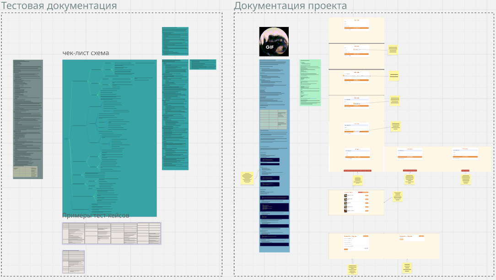

ShaurmaGo 🌯 — Full-stack веб-приложение для заказа еды.

ShaurmaGo — это комплексный пет-проект, созданный для демонстрации навыков в разработке и, в особенности, в обеспечении качества (QA) программного продукта. Проект имитирует реальный онлайн-сервис по заказу еды и включает в себя бэкенд на Python/Flask, фронтенд на нативном JavaScript и набор E2E-автотестов на Cypress.
Этот репозиторий служит не просто хранилищем кода, а полноценным портфолио, демонстрирующим мой подход к планированию, тестированию и документированию.

Этот проект изначально создавался для моего обучения автотестированию, но вырос в полноценное портфолио, демонстрирующее мой подход к ручному и автоматизированному тестированию, а также к созданию тестовой документации. Этот репозиторий активно развивается и служит полигоном для отработки новых методологий в тестировании.

Ключевые возможности проекта:
- Аутентификация: Безопасная регистрация и вход пользователей с использованием JWT-токенов для управления сессиями.
- Динамическое меню: Просмотр каталога товаров, который загружается с бэкенд-сервера.
- Интерактивная корзина: Удобное добавление и удаление товаров с автоматическим пересчетом итоговой суммы.
- Симуляция оплаты: Полный пользовательский сценарий оформления заказа с имитацией ввода платежных данных.
- Встроенный инструмент для тестирования: Специальная кнопка "Test 500 Error", которая намеренно вызывает внутреннюю ошибку сервера, позволяя тестировать реакцию UI и системы обработки ошибок.

Используемый стек технологий:
Бэкенд - Python, Flask, SQLAlchemy - REST API для управления пользователями, меню и заказами.

Фронтенд - HTML5, CSS3, JavaScript (ES6+) - Клиентская часть без использования фреймворков.

База данных - SQLite - Легковесная БД для разработки.

Автотесты - Cypress, JavaScript - End-to-End тесты для автоматизации пользовательских сценариев.

Инструменты - Git, npm, pip, Postman, VS Code - Стандартный набор инструментов для разработки и тестирования.

🔬 Тестирование и Обеспечение Качества (QA)
Одной из главных целей проекта было продемонстрировать зрелый и структурированный подход к обеспечению качества. Весь процесс тестирования был тщательно спланирован и задокументирован.
Визуальная тестовая документация в Miro
Для максимальной наглядности и удобства восприятия, вся структура тестовой документации, включая взаимосвязи между тест-планом, чек-листами и пользовательскими сценариями, была визуализирована на интерактивной доске в Miro.
[➡️ Посмотреть интерактивную доску в Miro](https://miro.com/app/board/uXjVIkzqnE4=/?share_link_id=74911620240)

Текстовая документация в репозитории:
Вся детальная документация находится в этом репозитории.
\shaurmago2\documentation

Подход к тестированию включал в себя следующие виды проверок:
Функциональное и модульное тестирование: Глубокая проверка каждой функции в изоляции, включая позитивные и негативные сценарии.
Тестирование сквозных пользовательских сценариев (E2E): Проверка полного пути пользователя для гарантии корректной интеграции всех модулей.
Тестирование UI/UX: Оценка визуальной составляющей, включая кросс-браузерное (Chrome, Firefox, Edge) и адаптивное (десктоп, планшет, мобильный) тестирование.
Тестирование API: Ручная проверка эндпоинтов с помощью Postman.
Тестирование доступности (Accessibility, a11y): Базовый аудит навигации с клавиатуры и контрастности интерфейса.
Детальное описание методологии и структуры проверок можно найти в Тест-плане.

🏁 Установка и запуск
Требования
Python 3.8+
Node.js 16+
Git

1. Настройка Бэкенда
# 1. Клонируйте репозиторий и перейдите в его папку
git clone https://github.com/VladislavTolockoQA/shaurmago-portfolio.git
cd shaurmago-portfolio

# 2. Создайте и активируйте виртуальное окружение Python
python -m venv venv
Для Windows:
.\venv\Scripts\Activate.ps1

Для macOS/Linux:
source venv/bin/activate

# 3. Установите зависимости Python (находясь в папке backend)
cd backend
pip install -r requirements.txt

# 4. Настройте переменные окружения
Скопируйте .env.example в .env и при необходимости измените значения
cp .env.example .env

# 5. Инициализируйте базу данных (создайте таблицы и наполните меню)
flask init-db

# 6. Запустите бэкенд-сервер (оставьте этот терминал работать)
flask run

Бэкенд будет доступен по адресу http://127.0.0.1:5000.

2. Настройка Фронтенда
Откройте НОВЫЙ терминал в корневой папке проекта

# 1. Установите зависимости для Cypress
npm install

# 2. Запустите фронтенд с помощью Live Server
Откройте папку проекта в VS Code и запустите Live Server
для любого HTML-файла в папке /frontend.

Фронтенд, скорее всего, будет доступен по адресу http://127.0.0.1:5500.

3. Запуск автотестов Cypress
Откройте ТРЕТИЙ терминал в корневой папке проекта

Убедитесь, что бэкенд и фронтенд запущены!

# Откройте Cypress Test Runner
npx cypress open

В открывшемся окне выберите браузер и запустите нужные тесты из папки cypress/e2e.
