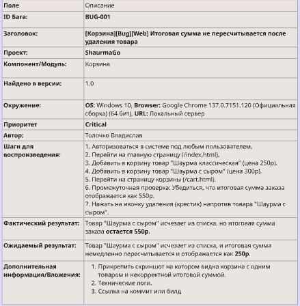

Баг-репорт №1: Критический функциональный дефект

Поле
Описание
ID Бага:
BUG-001
Заголовок:
[Корзина][Bug][Web] Итоговая сумма не пересчитывается после удаления товара
Проект:
ShaurmaGo
Компонент/Модуль:
Корзина
Найдено в версии:
1.0
Окружение:
OS: Windows 10, Browser: Google Chrome 137.0.7151.120 (Официальная сборка) (64 бит), URL: Локальный сервер
Приоритет 
Critical
Автор:
Толочко Владислав
Шаги для воспроизведения:
1. Авторизоваться в системе под любым пользователем.
2. Перейти на главную страницу (/index.html).
3. Добавить в корзину товар "Шаурма классическая" (цена 250р).
4. Добавить в корзину товар "Шаурма с сыром" (цена 300р).
5. Перейти на страницу корзины (/cart.html).
6. Промежуточная проверка: Убедиться, что итоговая сумма заказа отображается как 550р.
7. Нажать на иконку удаления (крестик) напротив товара "Шаурма с сыром".
Фактический результат:

Товар "Шаурма с сыром" исчезает из списка, но итоговая сумма заказа остается 550р.
Товар "Шаурма с сыром" исчезает из списка, и итоговая сумма немедленно пересчитывается и отображается как 250р.
Ожидаемый результат:
Дополнительная информация/Вложения:
Прикрепить скриншот на котором видна корзина с одним товаром и некорректной итоговой суммой.
Технические логи.
Ссылка на коммит или билд
