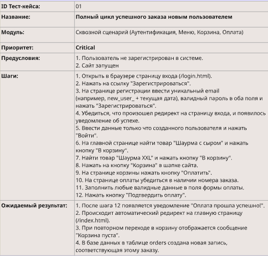
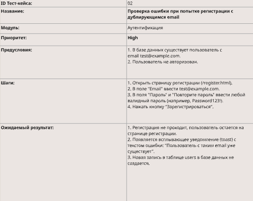
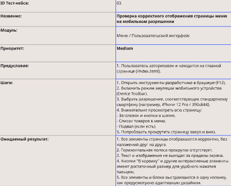
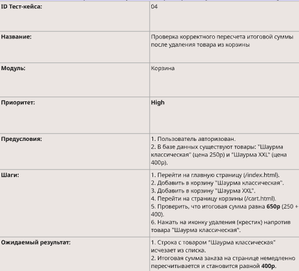

Тест-кейс №1: Успешный заказ новым пользователем (Позитивный, E2E)

ID Тест-кейса:
01
Название:
Полный цикл успешного заказа новым пользователем
Модуль:
Сквозной сценарий (Аутентификация, Меню, Корзина, Оплата)
Приоритет:
Critical
Предусловия:
1. Пользователь не зарегистрирован в системе.
2. Сайт запущен
Шаги:
1. Открыть в браузере страницу входа (/login.html).
2. Нажать на ссылку "Зарегистрироваться".
3. На странице регистрации ввести уникальный email (например, new_user_ + текущая дата), валидный пароль в оба поля и нажать "Зарегистрироваться".
4. Убедиться, что произошел редирект на страницу входа, и появилось уведомление об успехе.
5. Ввести данные только что созданного пользователя и нажать "Войти".
6. На главной странице найти товар "Шаурма с сыром" и нажать кнопку "В корзину".
7. Найти товар "Шаурма XXL" и нажать кнопку "В корзину".
8. Нажать на кнопку "Корзина" в шапке сайта.
9. На странице корзины нажать кнопку "Оплатить".
10. На странице оплаты убедиться в наличии номера заказа.
11. Заполнить любые валидные данные в поля формы оплаты.
12. Нажать кнопку "Подтвердить оплату".
Ожидаемый результат:
1. После шага 12 появляется уведомление "Оплата прошла успешно!".
2. Происходит автоматический редирект на главную страницу (/index.html).
3. При повторном переходе в корзину отображается сообщение "Корзина пуста".
4. В базе данных в таблице orders создана новая запись, соответствующая этому заказу.

Тест-кейс №2: Попытка регистрации с уже существующим email (Негативный сценарий)

ID Тест-кейса:
02
Название:
Проверка ошибки при попытке регистрации с дублирующимся email
Модуль:
Аутентификация
Приоритет:
High
1. В базе данных существует пользователь с email test@example.com. 
2. Пользователь не авторизован.
Предусловия:
Шаги:
1. Открыть страницу регистрации (/register.html).
2. В поле "Email" ввести test@example.com.
3. В поля "Пароль" и "Повторите пароль" ввести любой валидный пароль (например, Password123!).
4. Нажать кнопку "Зарегистрироваться".
Ожидаемый результат:
1. Регистрация не проходит, пользователь остается на странице регистрации.
2. Появляется всплывающее уведомление (toast) с текстом ошибки: "Пользователь с таким email уже существует".
3. Новая запись в таблице users в базе данных не создается.

Тест-кейс №3: Проверка адаптивности страницы меню на мобильном устройстве (UI/UX)

ID Тест-кейса:
03
Название:
Проверка корректного отображения страницы меню на мобильном разрешении
Модуль:

Меню / Пользовательский интерфейс

Приоритет:
Medium
Предусловия:
1. Пользователь авторизован и находится на главной странице (/index.html).
Шаги:
1. Открыть инструменты разработчика в браузере (F12).
2. Включить режим эмуляции мобильного устройства (Device Toolbar).
3. Выбрать разрешение, соответствующее стандартному смартфону (например, iPhone 12 Pro / 390x844).
4. Внимательно просмотреть всю страницу:
- Заголовок и кнопки в шапке.
- Список товаров в меню.
- Подвал (если есть).
5. Попробовать прокрутить страницу вверх и вниз.
Ожидаемый результат:
1. Все элементы страницы отображаются корректно, без наложений друг на друга.
2. Горизонтальная полоса прокрутки отсутствует.
3. Текст и изображения не выходят за пределы экрана.
4. Кнопки "В корзину" и другие интерактивные элементы имеют достаточный размер для удобного нажатия пальцем. 
5. Все элементы и блоки выстраиваются в одну колонку, как предусмотрено адаптивным дизайном.

Тест-кейс №4: Редактирование корзины и проверка пересчета итоговой суммы

ID Тест-кейса:
04
Название:
Проверка корректного пересчета итоговой суммы после удаления товара из корзины
Модуль:
Корзина
Приоритет:
High
Предусловия:
1. Пользователь авторизован.
2. В базе данных существуют товары: "Шаурма классическая" (цена 250р) и "Шаурма XXL" (цена 400р).
Шаги:
1. Перейти на главную страницу (/index.html).
2. Добавить в корзину "Шаурма классическая".
3. Добавить в корзину "Шаурма XXL".
4. Перейти на страницу корзины (/cart.html).
5. Проверить, что итоговая сумма равна 650р (250 + 400).
6. Нажать на иконку удаления (крестик) напротив товара "Шаурма классическая".
Ожидаемый результат:
1. Строка с товаром "Шаурма классическая" исчезает из списка.
2. Итоговая сумма заказа на странице немедленно пересчитывается и становится равной 400р.