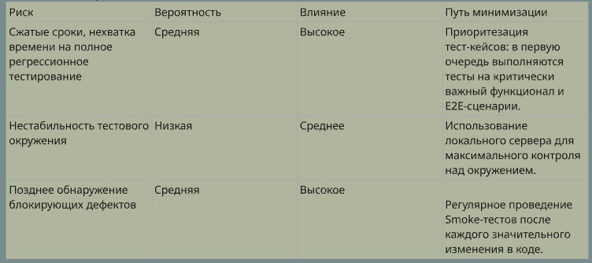

Тест-план для проекта "ShaurmaGo"
Проект: ShaurmaGo - Веб-приложение для заказа еды
Версия документа:1.0
Дата создания:28.06.2025
Автор: Толочко Владислав
1. Введение
1.1. Описание проекта
"ShaurmaGo" — это полнофункциональное веб-приложение (Full-stack), предназначенное для онлайн-заказа шаурмы. Проект включает в себя аутентификацию пользователей, каталог меню, интерактивную корзину и симуляцию процесса оплаты. Приложение разработано с использованием стека технологий Python/Flask на бэкенде и HTML/CSS/Vanilla JS на фронтенде.
1.2. Цели тестирования
Основной целью тестирования является всесторонняя оценка качества продукта перед его гипотетическим релизом.
Ключевые цели:
Проверить соответствие реализованного функционала заявленным требованиям.
Выявить и задокументировать максимальное количество дефектов.
Оценить стабильность и надежность приложения под различными сценариями использования.
Проверить удобство пользовательского интерфейса (UI/UX), включая адаптивность и кросс-браузерность.
Гарантировать, что ключевые бизнес-сценарии (от регистрации до оплаты) выполняются корректно и без сбоев.
2. Область тестирования (Scope)
2.1. Функционал, подлежащий тестированию (In-Scope)
Модуль аутентификации:
Регистрация нового пользователя.
Вход (логин) и выход (логаут) из системы.
Управление сессией на основе JWT-токенов.
Валидация данных в формах.
Модуль меню:
Отображение списка товаров.
Корректное отображение названий, цен, изображений.
Модуль корзины:
Добавление товаров в корзину.
Изменение количества товаров.
Удаление товаров из корзины.
Автоматический пересчет итоговой суммы.
Модуль оформления заказа:
Переход к оплате.
Симуляция процесса оплаты.
Создание заказа в базе данных.
Очистка корзины после успешного заказа.
API (Бэкенд):
Тестирование всех публичных и защищенных эндпоинтов на корректность ответов и статусов.
Пользовательский интерфейс (UI):
Верстка и стили на всех страницах.
Интерактивные элементы (кнопки, ссылки, поля ввода).
2.2. Функционал, не подлежащий тестированию (Out-of-Scope)
Нагрузочное и стресс-тестирование: Проверка производительности системы под высокой нагрузкой требует отдельных инструментов (k6, Locust) и будет проводиться в рамках отдельного этапа.
Углубленное тестирование безопасности: Поиск уязвимостей (SQL-инъекции, XSS, CSRF) требует специальных знаний и инструментов (Burp Suite, OWASP ZAP) и выходит за рамки данного плана.
Тестирование производительности базы данных: Анализ скорости выполнения запросов при больших объемах данных.
Тестирование локализации и интернационализации (L10n / i18n): Приложение разработано только для одного языка (русский).
3. Стратегия и подходы к тестированию
3.1. Уровни тестирования
Компонентное/Модульное тестирование: Проверка каждой функции в отдельности (например, только работа кнопки "добавить в корзину").
Интеграционное тестирование: Проверка взаимодействия между модулями (например, после добавления товара в корзину он корректно отображается на странице корзины).
Системное тестирование (E2E): Проверка всей системы как единого целого через сквозные пользовательские сценарии.
3.2. Виды тестирования
Функциональное тестирование: Будет проведено на основе чек-листов и детальных тест-кейсов для проверки всего функционала, описанного в разделе 2.1.
Тестирование UI/UX: Визуальная проверка верстки, адаптивности и удобства использования.
Кросс-браузерное тестирование: Проверка работоспособности приложения в указанных браузерах.
Тестирование доступности (Accessibility, a11y): Базовая проверка на соответствие стандартам доступности.
Регрессионное тестирование: Повторное выполнение набора ключевых тест-кейсов и E2E-сценариев после внесения исправлений или добавления нового функционала для гарантии того, что существующий функционал не был нарушен.
Smoke-тестирование (Дымовое): Быстрая проверка основного функционала ("счастливого пути") после получения новой сборки (билда) для принятия решения о возможности дальнейшего глубокого тестирования.
4. Ресурсы и окружение
4.1. Тестовое окружение
Бэкенд: Локальный сервер, запущенный командой flask run на http://127.0.0.1:5000.
Фронтенд: HTML-файлы, открытые в браузере (рекомендуется использовать Live Server).
Операционная система: Windows 11.
4.2. Браузеры для тестирования
Google Chrome (последняя версия)
Mozilla Firefox (последняя версия)
Microsoft Edge (последняя версия)
4.3. Инструменты
Браузер: Chrome DevTools (для инспекции элементов, анализа сети, симуляции мобильных устройств).
Тестирование API: Postman / Insomnia.
Ведение документации: Google Sheets / MS Excel, Markdown.
Создание скриншотов/видео: Любой удобный инструмент (например, ShareX, Monosnap).
5. Тестовые артефакты и отчетность
5.1. Тестовая документация
Тест-план (данный документ): Основополагающий документ.
Чек-листы и Тест-кейсы: Детальные пошаговые инструкции для выполнения проверок. Будут храниться в формате .xlsx или .md.
Баг-репорты: Все найденные дефекты будут задокументированы с указанием шагов воспроизведения, серьезности, приоритета и приложенных доказательств (скриншоты/видео).
5.2. Отчетность
Итоговый отчет о тестировании (Test Summary Report): Будет подготовлен по завершении цикла тестирования. Он будет содержать:
Краткую сводку о проделанной работе.
Статистику по выполненным тест-кейсам (Passed/Failed/Blocked).
Статистику по найденным и исправленным дефектам.
Общие выводы и рекомендации по качеству продукта.
6. Критерии качества
6.1. Критерии начала тестирования
Бэкенд-сервер успешно запускается без ошибок.
Основные страницы приложения доступны и открываются.
Проведен дымовой тест, который показал, что ключевой функционал (регистрация/вход) работает.
6.2. Критерии окончания тестирования (Definition of Done)
100% запланированных тест-кейсов выполнены.
0 открытых дефектов с уровнем серьезности Blocker или Critical.
Не более 3 открытых дефектов с уровнем серьезности Major.
Все найденные дефекты задокументированы.
Подготовлен и согласован итоговый отчет о тестировании.
7. Риски и пути их минимизации
